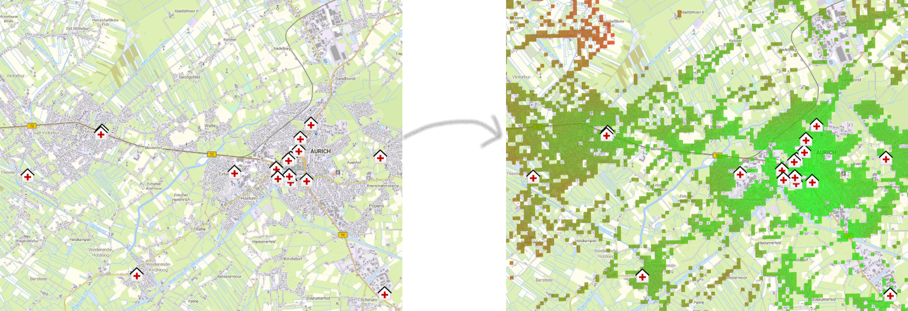

# openaccessibilityservice

The *openaccessibilityservice* provides a set of services to answer complex spatial accessibility problems.

The following services are avaiable via a HTTP interface:

* **Accessibility** - Reachability and opportunity based measures including two-step-floating-catchment-area methods
* **Queries** - Computes simple metrics based on the locally available infrastructures
* **Multi-Criteria** - Builds accessibility results based on mutliple weighted metrics

Generally speaking the *openaccessibilityservices* can be used to quantify and analyse the quality of locations based on the presence (or absence) of surrounding infrastructures or demand.



## Installation

To provide usefull results the *openaccessibilityservice* requires a routing-backend to provide travel-time information on a road network.

Currently there are two options:

* Using the *openrouteservice* (github.com/GIScience/openrouteservice)
* Using the *go-routing* server (github.com/ttpr0/go-routing)

For information on how to setup a routing-backend using OpenStreetMap data consult the respective documentation.

To launch the *openaccessibilityservice* a *Dockerfile* as well as a *docker compose* config are provided.

Using *docker compose* installing and launching the latest version of the *openaccessibilityservice* can be done as follows:

```bash
$ git clone https://github.com/ttpr0/openaccessibilityservice.git
$ cd openaccessibilityservice
$ docker compose up --build -d
```

For configuration (especially which routing-backends are available) use the *oas-config.yml* file. An example configuration using an *openrouteservice* running on localhost:8082 as the default backend looks as follows:

```yaml
routing:
  providers:
    - ors-api
    - routing-api
  default_provider: ors-api
  provider_options:
    ors-api:
      url: http://localhost:8082
    routing-api:
      url: http://localhost:5002
```

## Usage

All accessibility services can be called via HTTP interfaces. For more information on the available endpoints and parameters APIs are documented via OpenAPI.

Generally most endpoints share a set of request parameters, including parameters describing the distance-decay, routing-paremeters to use as well as the returned accessibility results.

### Distance-Decay

Parameters describing the distance-decay look as follows:

```json
{
  "decay_type": "hybrid", // the type of decay
  "max_range": 900, // the maximum distance threshold (distance weight goes to 0 outside)
  "ranges": [900, 1200, 1500], // a set of thresholds to describe the decay
  "range_factors": [1.0, 0.3, 0.1] // corresponding weight for every threshold in "ranges"
}
```

Depending on the type of decay only some parameters may be used (mostly only "max_range"). The resulting distance decay can be descibed as follows:

$$ w_{ij} = \left\{ \begin{array}{rcl} f(d_{ij}) & \mbox{for} \ d_{ij} \leq d_{max} \\ 0 & \mbox{for} \ d_{ij} > d_{max} \end{array}\right $$

($d_{max}$ is either taken from the "max_range" or the "ranges" parameter depending on which of these is provided)

Available distance-decays are:

* **binary** - binary step-function $f(d_{ij}) = 1$ giving equal weights to all reachable locations
* **linear** - linear weighting $f(d_{ij}) = 1 - \frac{d_{ij}}{d_{max}}$ from 1 to 0 at threshold
* **exponential** - expontential weighting $f(d_{ij}) = e^{-d_{ij} \delta}$ with impedance factor $\delta = -\frac{log(0.01)}{d_{max}}$
* **gaussian** - expontential weighting $f(d_{ij}) = e^{\frac{-d_{ij}^2}{\delta}}$ with impedance factor $\delta = -\frac{d_{max}^2}{log(0.01)}$
* **inverse-power** - power weighting $f(d_{ij}) = d_{ij}^{-\delta}$ with impedance factor $\delta = log_{d_{max}}(100)$
* **kernel-density** - density weighting $f(d_{ij}) = 0.75 * (1 - (\frac{d_{ij}}{d_{max}})^2)$
* **hybrid** - step-function $f(d_{max, i-1} < d_{ij} < d_{max, i}) = w_i$ using "ranges" $d_{max, i}$ and their corresponding "range_factors" $w_i$
* **polynom** - weighting polynom $f(d_{ij}) = a_0 d_{ij}^{n} + a_1 d_{ij}^{n-1} + ... + a_n$ given the coefficients $a_0, a_1, ..., a_n$ from "range_factors"

(Note that it is generally recomended to use either binary or hybrid decay functions, see Luo and Qi 2009)

### Routing-Parameters

To be added...

### Response-Parameters

To be added...

## Accessibility

TODO

### Supply-Demand-Ratio

To be added...

### Reachability

Computes a simple reachability measure. For every demand point the closest reachable supply (multiplied by distance decay) is computed.

$$ A_i = S_j * f(d_{ij}) $$

$S_j$ denotes the closest supply point $j$ to the demand point $i$. $d_{ij}$ the distance between them.

```json
{
  "demand": {
    "demand_locations": [[lon, lat], ...],
    "demand_weights": [w, ...],
  },
  "supply": {
    "supply_locations": [[lon, lat], ...],
    "supply_weights": [w, ...],
  },
  "decay": decay_parameters,
  "routing": routing_parameters,
  "response": response_parameters,
}
```

### Opportunity

Computes a simple opportunity measure. For every demand point the product of reachable supply and distance decay are summed up.

$$ A_i = \sum{S_j * f(d_{ij})} $$

When using a Gravity-Decay function ($d_{ij}^{-\delta}$) this method can also compute the basic gravity accessibility introduced by Hansen (1959).

$$ A_i = \sum{\frac{S_j}{d_{ij}^{\beta}}} $$

```json
{
  "demand": {
    "demand_locations": [[lon, lat], ...],
    "demand_weights": [w, ...],
  },
  "supply": {
    "supply_locations": [[lon, lat], ...],
    "supply_weights": [w, ...],
  },
  "decay": decay_parameters,
  "routing": routing_parameters,
  "response": response_parameters,
}
```

### Two-Step-Floating-Catchment-Area (2SFCA)

Computes the basic two-step-floating-catchment-area accessibility introduced by Luo and Wang (2003).

$$ A_i = \sum_j{\frac{S_j}{\sum_i{D_i(d_{ij} < d_{max})}}(d_{ij} < d_{max})} $$

$S_j$ denotes the weight of the reachable supply $j$, $D_i$ the demand of the demand point $i$ and $d_{ij}$ the travel-distance between them.

```json
{
  "demand": {
    "demand_locations": [[lon, lat], ...],
    "demand_weights": [w, ...],
  },
  "supply": {
    "supply_locations": [[lon, lat], ...],
    "supply_weights": [w, ...],
  },
  "catchment": range,
  "routing": routing_parameters,
  "response": response_parameters,
}
```

### Dynamic 2SFCA

Computes a dynamic two-step-floating-catchment-area accessibility as introduced by McGrail and Humphreys (2014).

$$ A_i = \sum_j{\frac{S_j}{\sum_i{D_i(d_{ij} < d_{max, i})}}(d_{ij} < d_{max,i})} $$

$S_j$ denotes the weight of the reachable supply $j$, $D_i$ the demand of the demand point $i$ and $d_{ij}$ the travel-distance between them. Compared to the basic 2SFCA method the catchment size and therefore $d_{max}$ is dependant on the demand point $i$.

A Possibile usecases would e.g. be different travel characteristics between population living in cities or nearby rural areas. Since people from rural areas are used to longer distances to reach their destination there might be a higher threshold to which travel-times are stil acceptable. Thus different catchment sizes lead to more realistic results.

```json
{
  "demand": {
    "demand_locations": [[lon, lat], ...],
    "demand_weights": [w, ...],
  },
  "catchment_indices": [2, 0, ...], // index of the catchement for every demand_location
  "supply": {
    "supply_locations": [[lon, lat], ...],
    "supply_weights": [w, ...],
  },
  "catchments": [range, ...],
  "routing": routing_parameters,
  "response": response_parameters,
}
```

### Enhanced 2SFCA

Computes the enhanced two-step-floating-catchment-area accessibility introduced by Luo and Qi (2009).

$$ A_i = \sum_j{\frac{S_j}{\sum_i{D_i * f(d_{ij})}} * f(d_{ij})} $$

$S_j$ denotes the weight of the reachable supply $j$, $D_i$ the demand of the demand point $i$ and $w_{ij} = f(d_{ij})$ the travel-friction (distance decay) between them.

```json
{
  "demand": {
    "demand_locations": [[lon, lat], ...],
    "demand_weights": [w, ...],
  },
  "supply": {
    "supply_locations": [[lon, lat], ...],
    "supply_weights": [w, ...],
  },
  "distance_decay": decay_parameters,
  "routing": routing_parameters,
  "response": response_parameters,
}
```

### Dynamic-Enhanced 2SFCA

Computes a dynamic enhanced two-step-floating-catchment-area accessibility similar to the method introduced by McGrail and Humphreys (2014).

$$ A_i = \sum_j{\frac{S_j}{\sum_i{D_i * f_i(d_{ij})}} * f_i(d_{ij})} $$

$S_j$ denotes the weight of the reachable supply $j$, $D_i$ the demand of the demand point $i$ and $w_{ij} = f_i(d_{ij})$ the travel-friction (distance decay) between them. The distance-decay function used depends on the demand point ($i$).
Therefore different travel characteristics can be included.

```json
{
  "demand": {
    "demand_locations": [[lon, lat], ...],
    "demand_weights": [w, ...],
  },
  "decay_indices": [2, 0, ...], // index of the decay for every demand_location
  "supply": {
    "supply_locations": [[lon, lat], ...],
    "supply_weights": [w, ...],
  },
  "decays": [decay_parameters, ...],
  "routing": routing_parameters,
  "response": response_parameters,
}
```

### Modified 2SFCA

Computes the modified two-step-floating-catchment-area accessibility.

$$ A_i = \sum_j{\frac{S_j}{\sum_i{D_i * w_{ij}}} * w_{ij}^2} $$

$S_j$ denotes the weight of the reachable supply $j$, $D_i$ the demand of the demand point $i$ and $w_{ij} ~ d_{ij}$ the travel-friction (distance decay) between them.

```json
{
  "demand": {
    "demand_locations": [[lon, lat], ...],
    "demand_weights": [w, ...],
  },
  "supply": {
    "supply_locations": [[lon, lat], ...],
    "supply_weights": [w, ...],
  },
  "distance_decay": decay_parameters,
  "routing": routing_parameters,
  "response": response_parameters,
}
```

### Nearest-Neighbour-Modified 2SFCA

Computes the nearest-neighbour modified two-step-floating-catchment-area accessibility introduced by Jamtsho et al. 2015.

$$ A_i = \sum_j{\frac{S_j}{\sum_i{D_i * w_{ij}}} * w_{ij}^2} $$

$S_j$ denotes the weight of the reachable supply $j$, $D_i$ the demand of the demand point $i$ and $w_{ij} ~ d_{ij}$ the travel-friction (distance decay) between them. Compared to the modified 2sfca method at max n nearest neighbours are considered.

```json
{
  "demand": {
    "demand_locations": [[lon, lat], ...],
    "demand_weights": [w, ...],
  },
  "supply": {
    "supply_locations": [[lon, lat], ...],
    "supply_weights": [w, ...],
  },
  "nearest_count": n, // number of nearest neighbours accounted for at max
  "distance_decay": decay_parameters,
  "routing": routing_parameters,
  "response": response_parameters,
}
```

### Enhanced Three-Step-Floating-Catchment-Area (3SFCA)

Computes the enhanced three-step-floating-catchment-area accessibility introduced by Wan et al. (2012).

$A_i = \sum_j{\frac{S_j}{\sum_i{D_i * w_{ij} * G_{ij}}} * w_{ij} * G_{ij}}$

$S_j$ denotes the weight of the reachable supply $j$, $D_i$ the demand of the demand point $i$ and $w_{ij} ~ d_{ij}$ the travel-friction (distance decay) between them and $G_{ij} the propability of demand $D_i$ choosing supply $S_j$ (Propabilities are computed using the Huff Model, see Luo 2014). Therefore every supply-points has an additional attraction value (all ones will result in original 3SFCA method).

```json
{
  "demand": {
    "demand_locations": [[lon, lat], ...],
    "demand_weights": [w, ...],
  },
  "supply": {
    "supply_locations": [[lon, lat], ...],
    "supply_weights": [w, ...],
  },
  "supply_attraction": [a, ...], // Supply weights used in propability computation
  "distance_decay": decay_parameters,
  "routing": routing_parameters,
  "response": response_parameters,
}
```

## Queries

To be added...

## Multi-Criteria

To be added...

